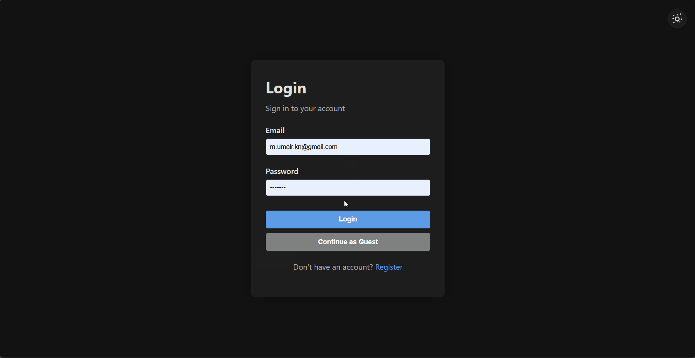

# CPUSAAS: An Animated CPU Scheduling Algorithm Simulator

A web-based application for *simulating* and *visualizing* **CPU scheduling algorithms**.

## Motivation

The motivation behind developing CPUSAAS is to provide a visual and interactive way to understand and analyze CPU scheduling algorithms. By simulating these algorithms, users can observe how different scheduling strategies affect process execution and performance metrics.

## 🚀 Quick Start
### Prerequisites

- Node.js (v14+)
- PostgreSQL (v12+)
- Git
### 1. Clone the repository
```bash
git clone https://github.com/mumairdotdev/cpusaas.git
cd cpusaas
```
### 2. Install dependencies in both client and server directories
```bash
cd client && npm install
cd ../server && npm install
```

### 3. Set up the PostgreSQL database
- Create a new PostgreSQL database named `cpu_scheduling`.
```sql
CREATE DATABASE cpu_scheduling;
```

### 4. Configure environment variables:
```bash
# Copy example environment file
cp .env.example .env

# Edit .env file with your database credentials
# Replace these values with your actualconfiguration
DB_HOST=localhost
DB_PORT=5432
DB_NAME=cpu_scheduling
DB_USER=your_username
DB_PASSWORD=your_password
JWT_SECRET=your_jwt_secret
```

### 5. Run the database setup script
```bash
cd server
node db_setup.js
```

### 6. Start the development servers
```bash
cd client && npm start
cd ../server && npm start
```

The application should now be running at `http://localhost:3000`


## Usage


## 🤝 Contributing
We welcome contributions! Please follow these steps to contribute:
1. Fork the repository.
2. Create a new branch: `git checkout -b feature/your-feature`.
3. Make your changes and commit them: `git commit -m "Add your message"`.
4. Push to the branch: `git push origin feature/your-feature`.
5. Open a pull request.